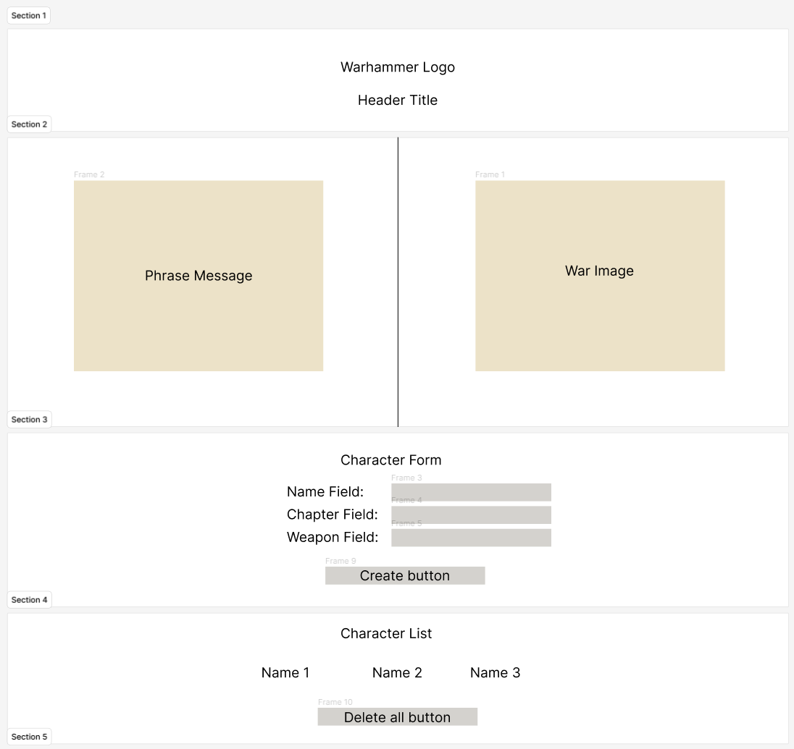
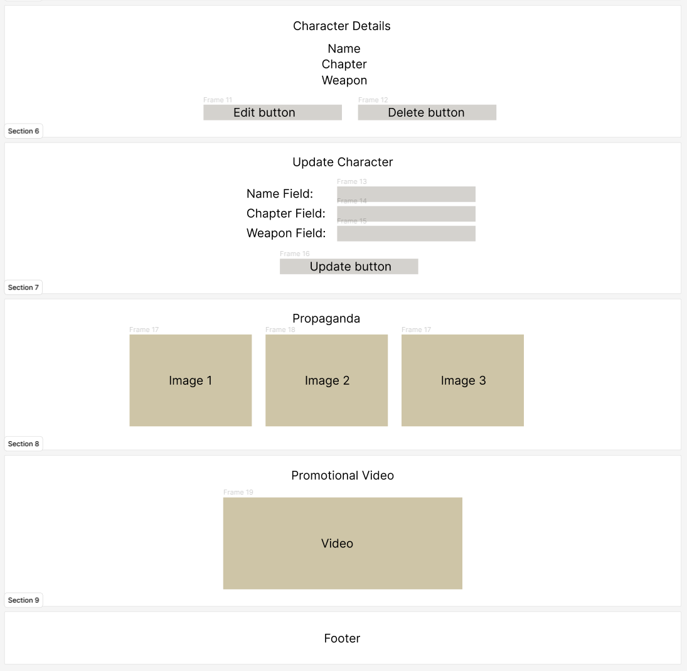

# Warhammer 40k - Datasheet Creator

## Table of Contents
- [Introduction](#introduction)
- [Features](#features)
- [Getting Started](#getting-started)
- [Usage](#usage)
- [Author](#author)
- [Design](#design)

## Introduction

Welcome to the Warhammer 40k - Datasheet Creator project! This web application allows you to create and manage characters for your Warhammer 40k army. Whether you're a loyal servant of the God Emperor or a heretic, this tool is designed to help you build your forces for the grim dark future.

## Features

- Create new Adeptus characters with names, chapters, and weapons.
- Edit and update character details.
- Delete individual characters or all characters at once.
- View a list of created characters.
- Display character details, including chapter and weapon.
- Modal alerts for various actions.
- Responsive design for mobile and desktop.

## Getting Started

To get started with this project, follow these steps:

1. Clone this repository to your local machine using `git clone`.
2. Open the project folder in your preferred code editor.
3. Make sure you have a web server or development environment set up (e.g., Node.js with `http-server`).
4. Launch the application by opening the `index.html` file in your web server.

## Usage

1. Fill out the character creation form with a name, chapter, and weapon.
2. Click the "For the GOD Emperor!" button to create a character.
3. View your list of characters in the "Adeptus List" section.
4. Click on a character's name to see their details.
5. Edit character details or delete characters as needed.
6. Use the "EXTERMINATUS!" button to delete all characters.
7. Enjoy creating your Warhammer 40k army!

## Design

## Author

This project was developed by Carlos Paz Ortega and Jaime Felipe Posada.

Feel free to reach out with any questions or feedback!
